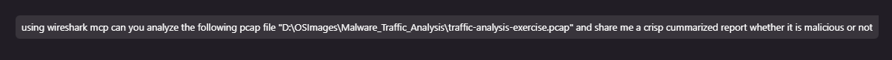
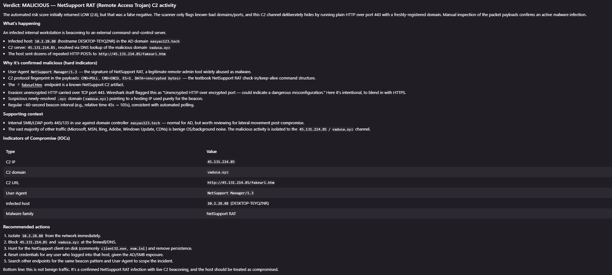

# Wireshark MCP

A small [Model Context Protocol](https://modelcontextprotocol.io/) server that
lets an AI agent capture and analyse network traffic.

Wireshark has no built-in MCP, so this server wraps **`tshark`** (the
command-line tool shipped with Wireshark) and exposes a focused set of tools
over MCP.

## How it works

```
MCP client (Gemini Code Assist / VS Code)
        │  stdio
        ▼
wireshark_mcp/server.py   ← FastMCP server, defines the tools
        │
        ▼
wireshark_mcp/tshark.py   ← runs tshark, parses its output
        │
        ▼
   tshark.exe (Wireshark)
```

Two files do all the work:

| File | Responsibility |
|------|----------------|
| `wireshark_mcp/server.py` | Registers the MCP tools and shapes their responses. |
| `wireshark_mcp/tshark.py` | `TsharkWrapper` (runs tshark), `PCAPParser` (analysis), and input validators. |

## Tools

**Setup & capture**

| Tool | Description |
|------|-------------|
| `check_installation` | Confirm tshark is installed; return its path and version. |
| `list_network_interfaces` | List interfaces available for capture. |
| `capture_packets` | Capture live traffic to a `.pcap` file (interface, duration, count, BPF filter). |

**Analysis**

| Tool | Description |
|------|-------------|
| `analyze_pcap` | Combined DNS + IP + protocol summary for a PCAP. |
| `apply_display_filter` | Apply any Wireshark display filter (e.g. `http.request`) and preview matches. |
| `decode_protocol` | Extract protocol fields as a compact table. Curated defaults for http, dns, tls, icmp, arp; arbitrary fields for anything else. |
| `extract_dns_queries` | DNS queries, with suspicious domains flagged. |
| `extract_ip_addresses` | Internal/external IPs, traffic counts, suspicious ports. |
| `get_protocol_statistics` | Protocol distribution. |
| `follow_stream` | Reassemble a TCP or UDP stream and return its payload. |
| `expert_info` | tshark expert analysis: warnings, errors, and notes by severity. |

**Threat detection** (our focus — not in most Wireshark MCPs)

| Tool | Description |
|------|-------------|
| `detect_threats` | Indicators of compromise plus a 0–10 risk score. |
| `generate_security_report` | Risk level, findings, and suggested mitigations. |

## Prerequisites

- Python 3.11+
- [Wireshark](https://www.wireshark.org/download/) installed, including `tshark`
  (the server auto-detects it on `PATH` or in the default install folder).
- Packet capture needs Administrator/root privileges.

## Project structure

This project lives inside the `Automation` workspace. The virtual environment
is at the workspace root, shared across all projects in the workspace.

```
Automation/                          ← VS Code workspace root
├── .gemini/
│   └── settings.json                ← Gemini Code Assist MCP config
├── .vscode/
│   └── mcp.json                     ← VS Code MCP config
├── venv/                            ← Python virtual environment (shared)
└── Wireshark_MCP/                   ← this project
    ├── .gitignore
    ├── README.md
    ├── requirements.txt
    ├── images/
    │   ├── wireshark-mcp-1.png
    │   └── wireshark-mcp-2.png
    └── wireshark_mcp/               ← Python package
        ├── __init__.py
        ├── __main__.py
        ├── server.py
        └── tshark.py
```

## Setup

The virtual environment lives one level up from the project (`Automation\venv\`).

```powershell
# From the Automation folder (workspace root)
python -m venv venv
.\venv\Scripts\Activate.ps1
pip install -r Wireshark_MCP\requirements.txt
```

Quick check that it starts (Ctrl+C to stop — it waits silently for a client):

```powershell
cd Wireshark_MCP
..\venv\Scripts\python.exe -m wireshark_mcp.server
```

## Connect a client

The server speaks MCP over stdio — the client launches it. The config files
live at the **workspace root** (`Automation/`), not inside `Wireshark_MCP/`.

> **Important:** Always use the full path to the venv `python.exe` — a bare
> `python` will use the system Python, which doesn't have the dependencies.

### VS Code (`.vscode/mcp.json`)

File: `Automation\.vscode\mcp.json`

```json
{
  "servers": {
    "wireshark-mcp": {
      "type": "stdio",
      "command": "c:\\Users\\DEEPAK\\Documents\\Automation\\venv\\Scripts\\python.exe",
      "args": ["-m", "wireshark_mcp.server"],
      "cwd": "c:\\Users\\DEEPAK\\Documents\\Automation\\Wireshark_MCP",
      "env": {
        "PYTHONUNBUFFERED": "1",
        "PYTHONDONTWRITEBYTECODE": "1",
        "PYTHONPATH": "c:\\Users\\DEEPAK\\Documents\\Automation\\Wireshark_MCP"
      }
    }
  }
}
```

> **Note:** VS Code uses `"servers"` as the top-level key and requires
> `"type": "stdio"`.

### Gemini Code Assist (`.gemini/settings.json`)

File: `Automation\.gemini\settings.json`

```json
{
  "mcpServers": {
    "wireshark-mcp": {
      "command": "c:\\Users\\DEEPAK\\Documents\\Automation\\venv\\Scripts\\python.exe",
      "args": ["-m", "wireshark_mcp.server"],
      "cwd": "c:\\Users\\DEEPAK\\Documents\\Automation\\Wireshark_MCP",
      "env": {
        "PYTHONUNBUFFERED": "1",
        "PYTHONPATH": "c:\\Users\\DEEPAK\\Documents\\Automation\\Wireshark_MCP",
        "PYTHONDONTWRITEBYTECODE": "1"
      }
    }
  }
}
```

> **Note:** Gemini Code Assist uses `"mcpServers"` as the top-level key (different
> from VS Code's `"servers"`).

After editing either config, reload VS Code (`Ctrl+Shift+P` → **Developer: Reload Window**),
then verify the connection:
- **VS Code:** `Ctrl+Shift+P` → **MCP: List Servers** — `wireshark-mcp` should appear.
- **Gemini Code Assist:** Type `/mcp` in the Gemini chat — it should list the server and its tools.

## Example prompts

Once connected, just talk to the agent in plain language — it picks the right tools:

```
Run check_installation and tell me the tshark version.
List my network interfaces.
Capture 60 seconds of DNS traffic on Ethernet.
Summarize ./traffic.pcap — what protocols and top talkers are in it?
From ./traffic.pcap, show me only the HTTP requests.
Decode the DNS queries in ./traffic.pcap and flag anything suspicious.
Follow TCP stream 0 in ./traffic.pcap and show me the payload.
Run expert analysis on ./traffic.pcap and group findings by severity.
Is ./traffic.pcap malicious? Detect threats and give me a security report.
```

### Malware triage (verdict report)

For a full "is this malicious?" investigation, ask for a verdict-style summary.
The agent will run threat detection, then dig into DNS/HTTP/TLS and stream
payloads to confirm or overturn the automated score before answering:

```
Using Wireshark MCP, analyze the PCAP at "D:\path\to\capture.pcap".
Correlate DNS, HTTP, and TLS traffic, follow suspicious streams, and check for
C2 beaconing or known malware patterns. Give me a crisp report: a clear
malicious/benign verdict, the infected host and C2 endpoints, key indicators of
compromise (IPs, domains, URLs, User-Agents, malware family), and recommended
actions. Don't rely on the risk score alone — verify with the packet payloads.
```

Tip: explicitly asking it to "verify with the packet payloads" matters — an
automated risk score can read LOW for malware that hides plain HTTP C2 over port
443 with a freshly-registered domain, so payload inspection is what confirms the
verdict.

#### Example: malware triage in action

A real run against a malware-traffic-analysis exercise capture. The prompt:



The agent's verdict report — a confirmed NetSupport RAT C2 infection, with the
infected host, C2 endpoints, indicators of compromise, and recommended actions:



Captures are written to `~/Documents/Wireshark_Captures/`.

### Useful display filters

For `apply_display_filter` / `decode_protocol`:

| Filter | Matches |
|--------|---------|
| `http.request` | HTTP requests only |
| `tcp.port == 443` | HTTPS traffic |
| `dns` | All DNS |
| `ip.addr == 10.0.0.1` | Traffic to/from a host |
| `tcp.flags.syn == 1 && tcp.flags.ack == 0` | TCP SYN (connection attempts) |

## Notes

- Threat detection uses lightweight heuristics (keyword/port/entropy checks),
  not a full threat-intelligence feed.
- Encrypted payloads can't be inspected, only metadata and protocol info.

## Security

- File paths are extension-checked and reject `..` path traversal.
- Display filters reject shell metacharacters (`;` `` ` `` `$(` `${` `|`).
  Wireshark operators like `==`, `>`, `&&` are allowed — tshark is always run
  with an explicit argv, never through a shell.
- `capture_packets` needs Administrator/root privileges.
